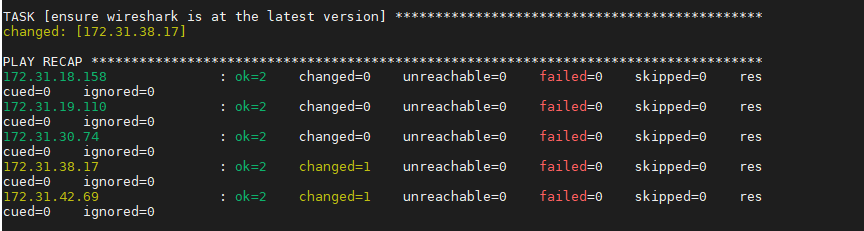

# Automating Project 7 to 10
- Rename Jenkins instance from Proj 9 to 'Jenkins'Ansible'
### Install Ansible
```sudo apt update
  sudo apt install ansible
  ansible --version
  ```
  

  ### Configure Jenkins build job to save your repository content everytime you change it
- Create a new Freestyle project ansible in Jenkins and point it to your ‘ansible-config-mgt’ repository.
- Configure Webhook in GitHub and set webhook to trigger ansible build.
- Configure a Post-build job to save all (**) files, like you did it in Project 9.
### Update your inventory/dev.yml file with this snippet of code:
```
[nfs]
<NFS-Server-Private-IP-Address> ansible_ssh_user='ec2-user'

[webservers]
<Web-Server1-Private-IP-Address> ansible_ssh_user='ec2-user'
<Web-Server2-Private-IP-Address> ansible_ssh_user='ec2-user'

[db]
<Database-Private-IP-Address> ansible_ssh_user='ec2-user' 

[lb]
<Load-Balancer-Private-IP-Address> ansible_ssh_user='ubuntu'
```

### Update playbooks/common.yml with code:
```
---
- name: update web, nfs and db servers
  hosts: webservers, nfs, db
  remote_user: ec2-user
  become: yes
  become_user: root
  tasks:
  - name: ensure wireshark is at the latest version
    yum:
      name: wireshark
      state: latest

- name: update LB server
  hosts: lb
  remote_user: ubuntu
  become: yes
  become_user: root
  tasks:
  - name: ensure wireshark is at the latest version
    apt:
      name: wireshark
      state: latest
```

## Running Ansible Test

```
ansible-playbook -i /var/lib/jenkins/jobs/ansible/builds/<build-number>/archive/inventory/dev.yml /var/lib/jenkins/jobs/ansible/builds/<build-number>/archive/playbooks/common.yml
```



### Verify installation on each of the servers
> wireshark --version


# SUCCESS!!